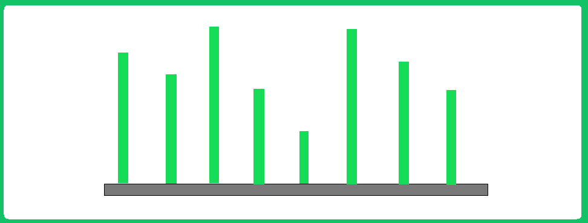
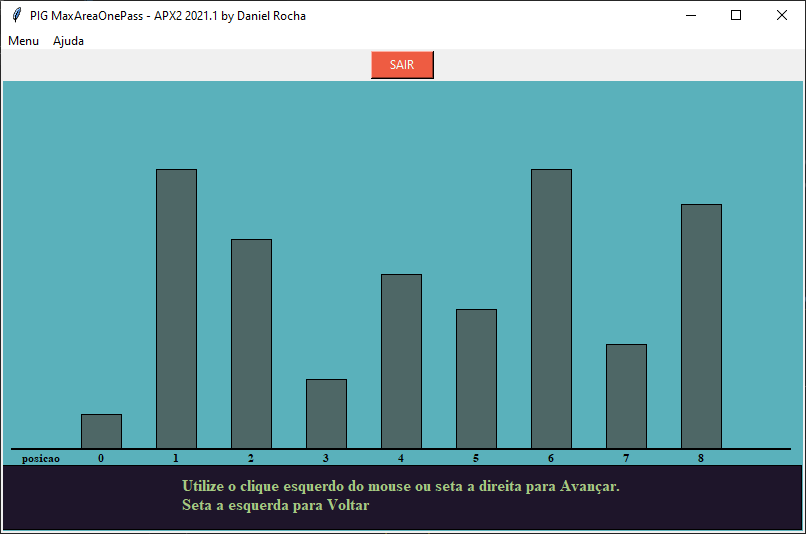

  
  
  
  
  
   

    
   

<!-- <<<Super-quickstart links go here>>> -->

Container With Most Water
================================================================================

*Submisstion about Container With Most Water coding challenge,  tkinter interactive GUI to explain OnePass algorithm.*

Introduction
--------------------------------------------------------------------------------

Given n non-negative integers a_1, a_2, ..., a_n where each represents a point at coordinate (i, a_i). ‘ n ‘ vertical lines are drawn such that the two endpoints of line i is at (i, a_i)             and (i, 0)             . 
Find two lines, which together with x-axis forms a container, such that the container contains the most water.
The program should return an integer which corresponds to the maximum area of water that can be contained (maximum area instead of maximum volume sounds weird but this is the 2D plane we are working with for simplicity).

Note: You may not slant the container. 
 
 

Challenge avaiable at:
 
https://leetcode.com/problems/container-with-most-water/
 

https://www.geeksforgeeks.org/container-with-most-water/

GUI TK Interface to explain step-by-step OnePass algorithm
--------------------------------------------------------------------------------
Features an interactive GUI made with tkinter to explain Onepass algorithm.

Quick start
--------------------------------------------------------------------------------
- `git clone https://github.com/danielbrazrocha/container-with-most-water`
 
- `cd container-with-most-water`
 
- `python APX2_DanielRocha.py`

 
